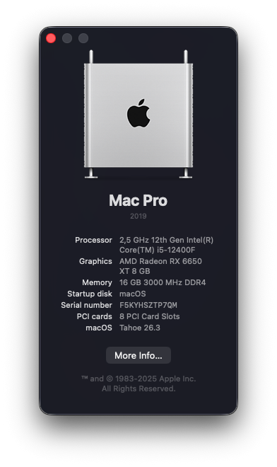
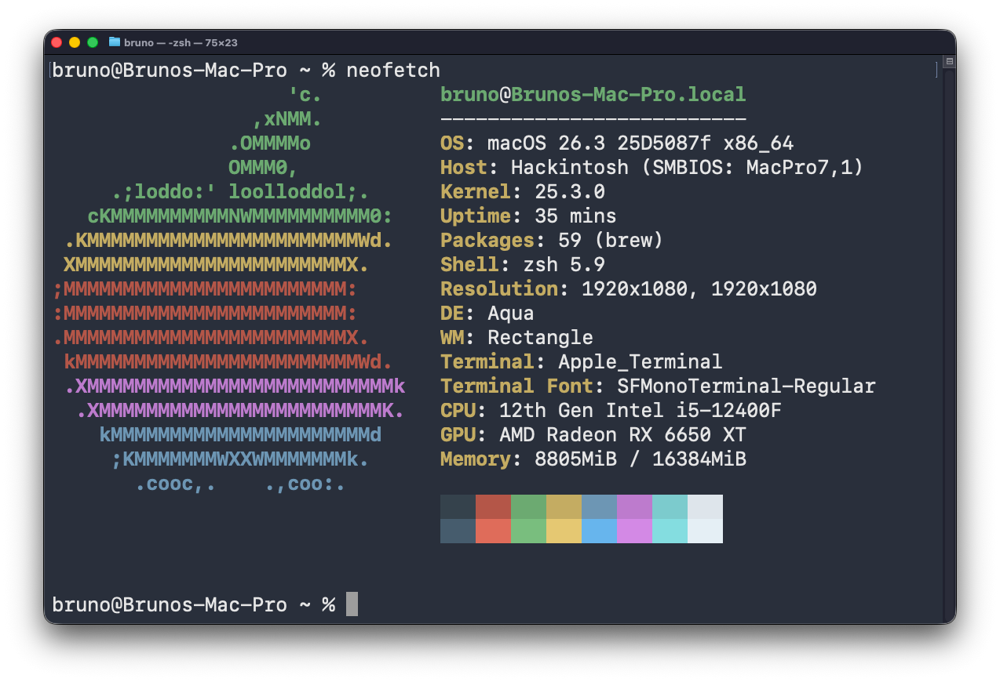

# 🍎 Hackintosh — B660M Aorus Pro DDR4 | i5-12400F | RX 6650 XT

  

  

---

## 📋 Hardware Specifications

| Component     | Model                                      |
| ------------- | ------------------------------------------ |
| **CPU**       | Intel Core i5-12400F (Alder Lake)          |
| **GPU**       | Powercolor Hellhound AMD Radeon RX 6650 XT |
| **Motherboard** | Gigabyte B660M Aorus Pro DDR4           |
| **RAM**       | HyperX Fury 2×8 GB DDR4 3200 MHz          |
| **Storage**   | Kingston SNV2S 1 TB NVMe M.2               |
| **Storage**   | XPG Gammix S41 256 GB NVMe M.2             |

---

## ✅ What's Working

| Feature              | Status |
| -------------------- | ------ |
| CPU Power Management | ✅     |
| GPU Acceleration     | ✅     |
| Audio                | ✅     |
| USB (mapped)         | ✅     |
| Bluetooth            | ✅ (generic USB adapter + BlueToolFixup) |
| Sleep / Wake         | ✅     |
| UEFI Secure Boot     | ✅     |
| DRM (Apple TV+, etc.)| ✅     |
| iServices (iMessage, FaceTime) | ✅ |
| NVMe drives          | ✅     |

## ❌ What's Not Working

| Feature   | Reason               |
| --------- | -------------------- |
| WiFi      | No card installed    |
| AirPlay   | Requires WiFi        |
| Sidecar   | Requires WiFi        |

---

## 🗂 EFI Overview

### SSDTs (`EFI/OC/ACPI/`)

| SSDT                                         | Purpose                                            |
| -------------------------------------------- | -------------------------------------------------- |
| [SSDT-PLUG-ALT](EFI/OC/ACPI/SSDT-PLUG-ALT.aml) | [Fixes power management on Alder Lake CPUs][1]     |
| [SSDT-EC](EFI/OC/ACPI/SSDT-EC.aml)          | [Fixes Embedded Controller][2]                     |
| [SSDT-USBX](EFI/OC/ACPI/SSDT-USBX.aml)     | [Provides USB power properties][2]                 |
| [SSDT-RTCAWAC](EFI/OC/ACPI/SSDT-RTCAWAC.aml)| [Fixes system clocks (RTC/AWAC)][3]                |
| [SSDT-SBUS](EFI/OC/ACPI/SSDT-SBUS.aml)      | Fixes SMBus support                                |
| [SSDT-USB-Reset](EFI/OC/ACPI/SSDT-USB-Reset.aml) | Resets USB controllers for proper mapping     |

[1]: https://github.com/acidanthera/OpenCorePkg/blob/master/Docs/AcpiSamples/Source/SSDT-PLUG-ALT.dsl
[2]: https://dortania.github.io/Getting-Started-With-ACPI/Universal/ec-fix.html
[3]: https://dortania.github.io/Getting-Started-With-ACPI/Universal/awac.html

### Kexts (`EFI/OC/Kexts/`)

| Kext                    | Purpose                                                                |
| ----------------------- | ---------------------------------------------------------------------- |
| **Lilu**                | Core patching engine — required by most other kexts                    |
| **VirtualSMC**          | Emulates the SMC chip found on real Macs                               |
| **SMCProcessor**        | CPU temperature monitoring via VirtualSMC                              |
| **SMCSuperIO**          | Fan speed and voltage monitoring via VirtualSMC                        |
| **NootRX**              | GPU driver patches for AMD Navi 23 (RX 6650 XT) — replaces WhateverGreen |
| **AppleALC**            | Native audio support through AppleHDA patching                         |
| **CPUFriend**           | Dynamic CPU power management data injection                            |
| **CPUFriendDataProvider** | Custom power management frequency vectors                           |
| **NVMeFix**             | NVMe power management and initialization fixes                        |
| **RestrictEvents**      | Shows the proper CPU name in About This Mac                            |
| **USBToolBox**          | USB mapping tool framework                                             |
| **UTBDefault**          | Default USB port map                                                   |
| **XHCI-unsupported**    | Enables unsupported XHCI controllers (600-series chipsets)             |
| **AMFIPass**            | Allows third-party kexts to load without disabling AMFI                |
| **BlueToolFixup**       | Patches Bluetooth stack for non-Apple Bluetooth adapters               |

### Drivers (`EFI/OC/Drivers/`)

| Driver              | Purpose                                     |
| ------------------- | ------------------------------------------- |
| **OpenRuntime.efi** | OpenCore runtime services                   |
| **OpenCanopy.efi**  | GUI boot picker with themes                 |
| **HfsPlus.efi**     | HFS+ filesystem support                     |
| **ResetNvramEntry.efi** | Adds "Reset NVRAM" entry to boot picker |
| **apfs_aligned.efi** | APFS filesystem driver for boot            |

---

## 🔧 BIOS Settings

> [!IMPORTANT]
> These are the recommended BIOS settings for the Gigabyte B660M Aorus Pro DDR4. Your settings may vary.

**Disable:**
- Fast Boot
- CSM (Compatibility Support Module)
- CFG Lock (if available)

**Enable:**
- Above 4G Decoding
- Re-Size BAR Support
- XHCI Hand-off
- EHCI/XHCI Hand-off

---

## 🔐 UEFI Secure Boot with OpenCore

This build dual-boots with **Windows 11**, which requires UEFI Secure Boot to be enabled. Instead of creating custom Secure Boot keys, I used the simpler **EFI enrollment** method: the OpenCore `.efi` files are added to the firmware's `db` (allowed signatures) variable so the BIOS treats them as trusted — no files are modified.

<strong>Steps (click to expand)</strong>

1. **BIOS** — Disable UEFI Secure Boot.
2. **macOS** — Prepare a USB stick with OpenCore on its EFI partition. Copy `/usr/standalone/i386/boot.efi` into the EFI folder of the USB stick.
3. **BIOS** — Key Management:
   - *Secure Boot → Key Management → Reset to Default Keys*
   - *Secure Boot → Key Management → Enroll EFI Image* — add each `.efi` one by one:
     - `EFI/BOOT/bootx64.efi`
     - `EFI/OC/OpenCore.efi`
     - All files in `EFI/OC/Drivers/`
     - All files in `EFI/OC/Tools/`
     - `EFI/boot.efi`
4. **BIOS** — Enable UEFI Secure Boot and reboot.
5. Select the USB stick's partition and verify OpenCore + macOS boot correctly.

> [!NOTE]
> Whenever you **update OpenCore**, you must re-enroll the new `.efi` files. Whenever you **update macOS**, get the new `boot.efi` from `/usr/standalone/i386/` and enroll it again. Consider resetting keys to defaults before re-enrolling. Windows continues to boot normally because OEM/Microsoft certificates remain untouched.

Full guide by **miliuco**: [UEFI Secure Boot and OpenCore — the easy way](https://www.insanelymac.com/forum/topic/359677-uefi-secure-boot-and-opencore-the-easy-way-0/)

---

## ⚠️ Disclaimer

> [!CAUTION]
> This EFI is configured specifically for **my hardware**. Do **not** use it as-is on a different build. You must generate your own SMBIOS serial numbers using [GenSMBIOS](https://github.com/corpnewt/GenSMBIOS) before using iServices.

---

## 🙏 Credits

- [**Acidanthera**](https://github.com/acidanthera) — OpenCore, Lilu, VirtualSMC, AppleALC, NVMeFix, RestrictEvents
- [**ChefKissInc**](https://github.com/ChefKissInc) — NootRX
- [**Dortania**](https://dortania.github.io/OpenCore-Install-Guide/) — OpenCore Install Guide
- [**USBToolBox**](https://github.com/USBToolBox) — USB mapping tools
- [**0xFireWolf**](https://github.com/0xFireWolf) — AMFIPass
- [**miliuco**](https://www.insanelymac.com/forum/topic/359677-uefi-secure-boot-and-opencore-the-easy-way-0/) — UEFI Secure Boot easy enrollment guide
